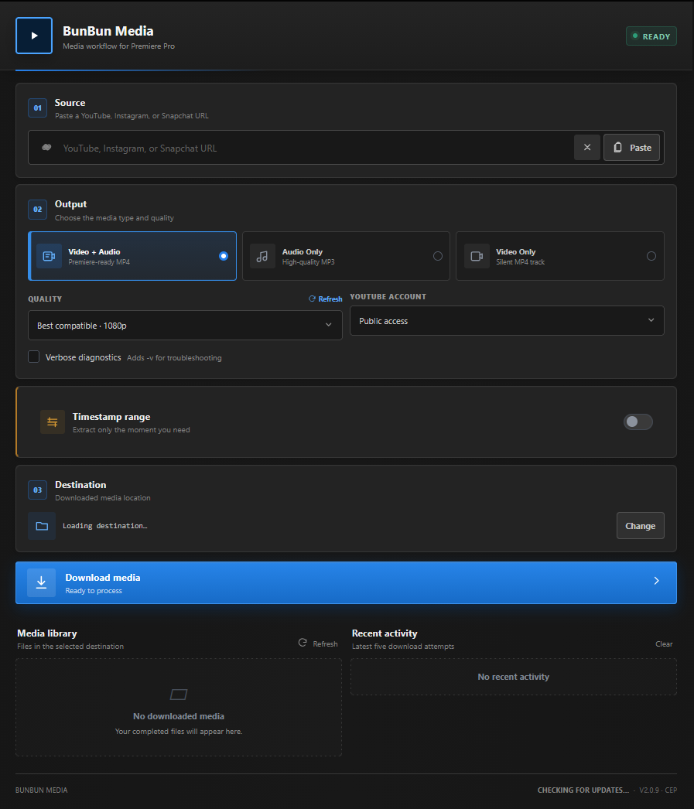

<div align="center">

### 🎬 BunBunMedia: Adobe CEP Media Automation

[](https://adobe.com)
[](https://developer.mozilla.org/)
[](https://github.com/yt-dlp/yt-dlp)
[](https://ffmpeg.org)
[](./tests)

<p>A lightweight Adobe CEP extension panel designed to automate media workflows, handle timecode tracking, and simplify asset management within your creative suite.</p>

<p align="center">
  
</p>

---
</div>

> [!IMPORTANT]
> Download only media you own or are authorized to use. You are responsible for complying with YouTube's terms and applicable copyright law.

## Highlights

- Download video with audio, audio-only MP3, or silent video.
- Choose from compatible 360p through 2160p presets or refresh the source's exact yt-dlp formats.
- Cut a section using `SS`, `MM:SS`, or `HH:MM:SS` timestamps.
- Use browser sessions or a Netscape-format `cookies.txt` for media your account may access.
- Follow live progress, cancel work, inspect command output, and browse recent downloads.
- Import a file into the project bin or append it to video track 1 of the active sequence.
- Use bundled yt-dlp, Deno, FFmpeg, and ffprobe in release packages.

## Requirements

- Windows 10 or 11
- Adobe Premiere Pro 2019 (13.0) or newer
- Internet access
- Permission to download and use the requested media

## Install

For most users:

1. Download the latest `BunBunMedia.zip` from the repository's **Releases** page. Do not use GitHub's automatically generated "Source code" archives; they do not contain the runtime tools.
2. Extract the complete ZIP to a writable folder.
3. Double-click `Setup.bat` (or `INSTALL.bat`).
4. Select **Install**, wait for completion, and restart Premiere Pro.
5. In Premiere, open **Window > Extensions > BunBun Media**.

The installer enables CEP `PlayerDebugMode` for CSXS 8–15 and copies the extension to:

```text
%APPDATA%\Adobe\CEP\extensions\BunBunMedia
```

See the [user guide](docs/USER_GUIDE.md) for timestamp clips, sign-in options, importing, updates, and uninstall instructions. If the panel does not appear or a download fails, use the [troubleshooting guide](docs/TROUBLESHOOTING.md).

## Quick use

1. Paste a supported YouTube video, Short, or livestream URL.
2. Choose the output type and maximum quality.
3. Optionally enable a timestamp range and enter a start, an end, or both.
4. Choose a download folder and select **Download media**.
5. Import the result to the project bin or active timeline.

Public videos normally need no sign-in. For media your account can access, choose a supported browser or a `cookies.txt` file. Treat exported cookies as credentials: never commit, upload, or share them.

## Development

The panel uses HTML, CSS, ES5-compatible JavaScript, Adobe's CEP bridge, and Premiere ExtendScript. The only automated test currently needs Node.js 18 or newer and has no package dependencies.

```powershell
npm test
```

Start with [CONTRIBUTING.md](CONTRIBUTING.md), then see the [development guide](docs/DEVELOPMENT.md) and [architecture overview](docs/ARCHITECTURE.md).

## Repository layout

```text
CSXS/          CEP extension manifest
css/           panel styles
js/            panel logic and yt-dlp/FFmpeg integration
jsx/           Premiere Pro host-side ExtendScript
tests/         dependency-free Node tests
docs/          user, development, architecture, and support guides
.github/       CI workflow and contribution templates
Setup.ps1      graphical Windows installer
```

## Support and security

- Search existing issues before opening a [bug report](.github/ISSUE_TEMPLATE/bug_report.yml).
- Include Premiere/Windows versions, reproduction steps, and sanitized technical output.
- Do not include cookie files, session data, personal paths, or private media URLs.
- Report vulnerabilities according to [SECURITY.md](SECURITY.md), not in a public issue.

## Update checks

BunBun Media checks the latest stable GitHub Release whenever the panel starts in Premiere. The footer also provides a manual **Check for updates** action. When a newer version is available, the panel displays its version and provides a button that opens the [GitHub Releases page](https://github.com/xosmos01-cyber/BunBunMedia/releases).

The panel does not download, install, or execute extension updates. Download the latest full release package from GitHub and run `Setup.bat` to update the installed extension.

## Releases and third-party software

Release archives may include yt-dlp, Deno, FFmpeg, ffprobe, and Adobe's CSInterface bridge. Their licenses are independent of this project's licensing. See [THIRD_PARTY_NOTICES.md](THIRD_PARTY_NOTICES.md).

The large release ZIP and executable files are intentionally excluded from normal Git history. Maintainers assemble them as described in the [development guide](docs/DEVELOPMENT.md#building-a-release).

## License

No project license has been declared yet. Until the maintainer adds one, copyright law reserves all rights to the project's original code and documentation. Third-party components retain their own licenses.
